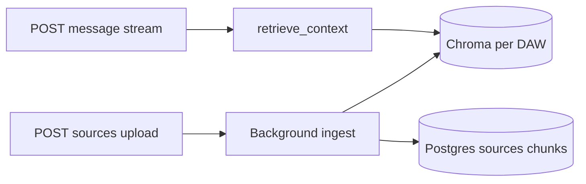

# Phase 5 RAG — Audit, gaps, and minimal fixes

## Audit summary

Read in full (or requested slice):

- `[backend/services/rag.py](backend/services/rag.py)` — embed query → Chroma `query` with `where source_id $in` → FlashRank lazy singleton → formatted block; logs injection.
- `[backend/services/embeddings.py](backend/services/embeddings.py)` — Ollama `OLLAMA_URL` + retries (3×, 5s); batch loops `embed_text`.
- `[backend/routers/sources.py](backend/routers/sources.py)` — upload with dedup hash, `processing` → background `_ingest_source` → Chroma + `source_chunks` + `complete` / `error`; DELETE Chroma `where` then Postgres CASCADE.
- `[backend/routers/chats.py](backend/routers/chats.py)` — `_assembled_system_prompt` (lines 148–306): 808notes + `user_query_for_rag` + `daw_id` + `rag_enabled` not false → load `chat_source_selections` → `retrieve_context` → append block → `rag_context_chars` on log line.
- `[backend/schema.sql](backend/schema.sql)` — `sources` (embedding_status: `pending`  `processing`  `complete`  `error`), `source_chunks`, `chat_source_selections` + FK CASCADE consistent with delete path.
- `[frontend/src/pages/notes808/SourcesPanel.jsx](frontend/src/pages/notes808/SourcesPanel.jsx)` — `listSources` query with `refetchInterval` when any row is `processing` or `pending`; `getChatSourceSelection` / `setChatSourceSelection` on toggle; checkbox gated on `complete` + `chatId`.

---

## Acceptance criteria vs current code

| Criterion                                  | Verdict                            | Notes                                                                                                                                                                                                                                                                                                                                                                 |
| ------------------------------------------ | ---------------------------------- | --------------------------------------------------------------------------------------------------------------------------------------------------------------------------------------------------------------------------------------------------------------------------------------------------------------------------------------------------------------------- |
| Upload .txt → `embedding_status: complete` | **Gap if MIME is wrong**           | Happy path with `text/plain` / `text/markdown` works. `[parse_source_bytes](backend/services/chunking.py)` does **not** accept `application/octet-stream`. Upload uses `file.content_type or "application/octet-stream"` (`[sources.py` L139–144](backend/routers/sources.py)), so missing or generic type → `ValueError` on preflight parse → **400 before insert**. |
| SourcesPanel: list + checkbox + polling    | **Pass**                           | Polls every 2s while `processing` or `pending` (`[SourcesPanel.jsx` L38–44](frontend/src/pages/notes808/SourcesPanel.jsx)). New rows start as `processing` (`[sources.py` L186](backend/routers/sources.py)).                                                                                                                                                         |
| Checkbox → `setChatSourceSelection`        | **Pass**                           | `syncSelection` → `[setChatSourceSelection](frontend/src/pages/notes808/SourcesPanel.jsx)` with UUID strings; backend `[SourceSelectionBody.source_ids](backend/routers/chats.py)`.                                                                                                                                                                                   |
| Send message → `rag_context_chars > 0`     | **Pass when infra + selection OK** | Stream path calls `_assembled_system_prompt(..., user_query_for_rag=body.content.strip())` ([~L1175+](backend/routers/chats.py)). Zero chars means: no selection, embed/Chroma failure, empty retrieval, or `rag_enabled` false — **verify with logs**, not a structural code bug.                                                                                    |
| Model cites source content                 | **Behavioral**                     | Prompt already instructs citing `[SOURCE: …]` (`[rag.py` L79–82](backend/services/rag.py)). No extra code required for Phase 5 polish scope.                                                                                                                                                                                                                          |
| Delete → Postgres + Chroma                 | **Pass**                           | `[delete_source](backend/routers/sources.py)`: `coll.delete(where={"source_id": str(source_id)})` then `DELETE FROM sources` (CASCADE cleans chunks + selections).                                                                                                                                                                                                    |

**Non-code / verify-only**

- `**OLLAMA_URL` / `CHROMA_*`** must match deployment (`[embeddings.py` L18–19](backend/services/embeddings.py), `[db.py` L87–92](backend/db.py)). User’s `100.101.41.16:11434` belongs in env, not hardcoding.
- **Chroma `$in` filter** on string `source_id` metadata matches ingest (`[sources.py` L64–66](backend/routers/sources.py) vs `[rag.py` L48](backend/services/rag.py)); confirm with the provided `list_collections` / query smoke test.

**Out of scope (per your instructions)**

- No schema changes.
- No Phase 5.5+ features.

---

## Fix only what’s broken (recommended single patch)

**What was wrong:** `.txt` (and sometimes `.md`) uploads often arrive as `application/octet-stream` or with empty `Content-Type`, so strict MIME validation rejects them even though `[_mime_to_source_type](backend/routers/sources.py)` labels the row type as `txt`.

**Minimal diff (choose one place — prefer one file):**

**Option A — `[backend/routers/sources.py](backend/routers/sources.py)`** (keeps `[chunking.py](backend/services/chunking.py)` untouched per your constraint):

- After `mime = file.content_type or "application/octet-stream"`, if `mime == "application/octet-stream"` (or parse raises), attempt `parse_source_bytes(raw, "text/plain")` for validation / ingest by passing an **effective** MIME into `_ingest_source` (e.g. `text/plain` when raw decodes as UTF-8). Narrow condition (e.g. size cap + successful UTF-8 decode) avoids treating large binaries as text.

**Option B — `[backend/services/chunking.py](backend/services/chunking.py)`** (you allowed exceptions for a **confirmed** bug):

- Add `application/octet-stream` to `parse_source_bytes` → `parse_text` **or** decode with `errors="replace"` only when callers need it — **riskier** for arbitrary binary uploads.

Recommendation: **Option A** in `sources.py` only: small, explicit, and limited to upload path.

---

## Test sequence (after optional patch)

Use your commands unchanged:

1. `\dt` / grep `source` — tables present.
2. `docker logs ... | grep -E "RAG|embedding|chunk|rag_context"` — ingest + `rag_context_chars` on send.
3. `get_chroma().list_collections()` — collection exists for normalized DAW id.

Extra manual step: upload a `.txt` **with** and **without** forcing `Content-Type` in something like `curl` to confirm the octet-stream path.