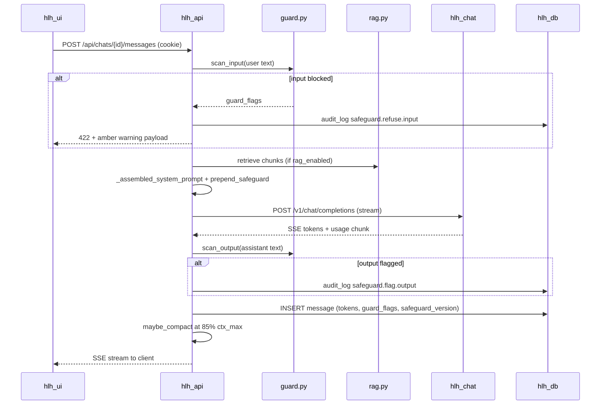
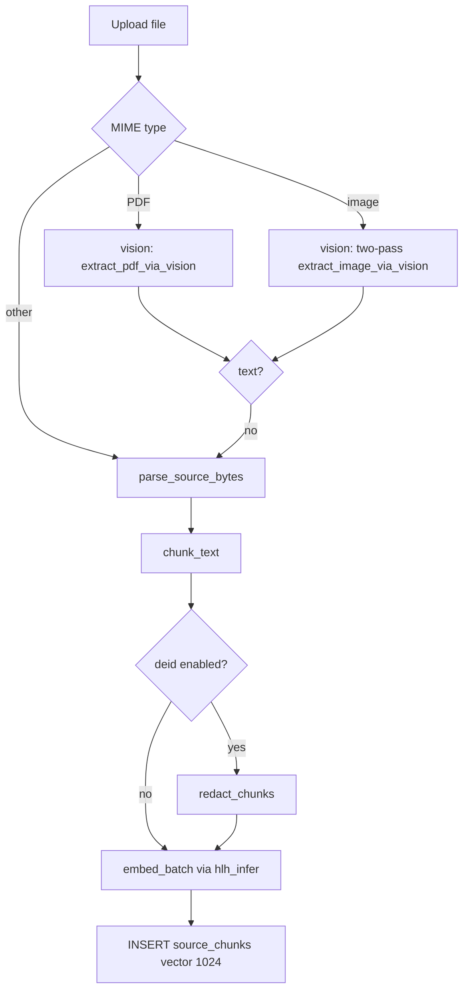

# homelabhealth — Architecture

System architecture for **homelabhealth** as of **`v1.1.0`** (2026-05-28).
Cross-check against [CHANGELOG.md](../CHANGELOG.md) and `git log` when tagging;
this doc is the structural companion to [roadmap.md](roadmap.md) (phases) and
[CONTEXT.md](CONTEXT.md) (agent bootstrap).

---

## Overview

homelabhealth is a single-user, self-hosted RAG chat application for personal
health records. One Docker Compose stack runs the API, UI, PostgreSQL/pgvector,
and bundled AI sidecars (chat, embed/rerank, search). Built-in username/password
auth gates the API; optional reverse proxy adds defense in depth.

**Design goals:** plug-and-play default deploy, bundled AI by tier, medical
safeguards, column encryption, de-identification on ingest, audit trail.

---

## Container topology

```
┌─────────────────────────────────────────────────────────────────────────┐
│  Browser  →  hlh_ui :9604 (nginx)  →  hlh_api :9600 (FastAPI)           │
└─────────────────────────────────────────────────────────────────────────┘
                                    │
          ┌─────────────────────────┼─────────────────────────┐
          │ hlh_default             │ hlh_inference (internal) │
          ▼                         ▼                          │
   ┌────────────┐            ┌────────────┐            ┌────────────┐
   │  hlh_db    │            │ hlh_search │            │  hlh_chat  │
   │  pg16+     │            │  SearXNG   │            │ llama.cpp  │
   │  pgvector  │            │  :9612     │            │  :9610     │
   └────────────┘            └────────────┘            └────────────┘
                                    │                          │
                                    │                   ┌────────────┐
                                    │                   │ hlh_infer  │
                                    │                   │ infinity   │
                                    │                   │  :9611     │
                                    └───────────────────┴────────────┘
```

| Service | Image / build | Host port | Network | Role |
|---------|---------------|-----------|---------|------|
| `hlh_ui` | `./frontend` | 9604 | `hlh_default` | Static React app; proxies `/api` to API |
| `hlh_api` | `./backend` | 9600 | `hlh_default`, `hlh_inference` | FastAPI — all business logic |
| `hlh_db` | `pgvector/pgvector:pg16` | — | `hlh_default` | PostgreSQL 16 + pgvector (1024-dim) |
| `hlh_chat` | `llama.cpp:server-b9282` | — | `hlh_inference` | Chat completions; optional `--mmproj` vision |
| `hlh_infer` | `michaelf34/infinity:0.0.77-cpu` | — | both | `/v1/embeddings` + `/v1/rerank` |
| `hlh_search` | `searxng/searxng:2026.5.22-…` | 9612 | `hlh_default` | Meta-search for web grounding |
| `hlh_orchestra` | `./hlh_orchestra` | — | `hlh_default` | Smart-bootstrap entry point and lifecycle manager |

**Compose profile:** `bundled` (default in `.env.example`) enables `hlh_chat`,
`hlh_search`. `bundled-gpu` swaps the CUDA llama.cpp image. Set
`COMPOSE_PROFILES=` empty for external-only AI.

**Smart bootstrap (alternative to compose):** `docker run -v
/var/run/docker.sock:/var/run/docker.sock -e HLH_BOOTSTRAP=1
ghcr.io/indifferentketchup/hlh_orchestra:latest` brings up the whole stack
from a single image. The orchestra creates networks, volumes, and secrets,
pulls every other image, and starts containers in dependency order. Stays
running as the lifecycle manager. See
[2026-05-28-smart-orchestra-bootstrap-design.md](superpowers/specs/2026-05-28-smart-orchestra-bootstrap-design.md).

**Volumes:**

| Volume | Mount | Purpose |
|--------|-------|---------|
| `hlh_db_data` | Postgres data dir | Database |
| `hlh_models` | `/models` (api rw, chat ro) | GGUF weights, mmproj symlink |
| `hlh_uploads` | `/data/uploads` | Source file storage |
| `hlh_keys` | `/data/keys` | Auto-generated encryption keys |
| `hlh_branding` | `/data/branding` | User icons |
| `hlh_history` | `/data/history` | Chat export history |
| `hlh_config` | `/data/config` (orchestra) | Bootstrap-generated secrets, `models.ini`, `searxng_settings.yml` |

All services except Postgres/nginx use `read_only: true`, `cap_drop: [ALL]`,
`no-new-privileges`. See [THREATMODEL.md](../THREATMODEL.md).

---

## Application layers

```
┌──────────────────────────────────────────────────────────┐
│  Frontend (React 18, Vite, Zustand, TanStack Query)       │
│  pages/ · components/chat|settings|sources/ · api/       │
└────────────────────────────┬─────────────────────────────┘
                             │ HTTP / SSE (hlh_session cookie)
┌────────────────────────────▼─────────────────────────────┐
│  API (FastAPI) — backend/routers/*                       │
│  deps.get_principal → session auth on protected routes     │
└────────────────────────────┬─────────────────────────────┘
                             │
┌────────────────────────────▼─────────────────────────────┐
│  Services — backend/services/*                           │
│  rag · embeddings · vision · compaction · guard · crypto   │
└────────────────────────────┬─────────────────────────────┘
                             │
┌────────────────────────────▼─────────────────────────────┐
│  PostgreSQL — schema.sql (idempotent on every boot)        │
└──────────────────────────────────────────────────────────┘
```

### API routers (`/api/…`)

| Prefix | Router | Primary responsibility |
|--------|--------|------------------------|
| `/auth` | `auth.py` | Login, logout, setup, `/me` |
| `/chats` | `chats.py` | Chat CRUD, SSE streaming, compaction trigger |
| `/workspaces` | `workspaces.py` | Workspace CRUD, provider binding |
| `/sources` | `sources.py` | Upload, ingest, reingest, content |
| `/providers` | `providers.py` | Provider CRUD (bundled rows immutable) |
| `/models` | `models.py` | Model pull, tier registry |
| `/system` | `system.py` | Sysinfo, tier, doctor, HF token |
| `/settings` | `settings.py` | Global settings, context-bar toggle |
| `/audit` | `audit.py` | Refusal log (`/refusals`) |
| `/search` | `search.py` | Web search proxy via SearXNG |
| `/memory` | `memory.py` | Mode memory (singleton) |
| `/history` | `history.py` | Export history files |

Auth endpoints and `/health` are unauthenticated; everything else requires
`hlh_session` (`backend/deps.py`).

### Lifespan boot sequence (`main.py`)

1. `ensure_keys()` — auto-generate `HLH_MASTER_KEY` / provider key if missing
2. `install_redactor()` — PHI scrubbing on logs
3. `init_pool()` + `apply_schema()` — idempotent schema from `schema.sql`
4. `ensure_super_admin()` — seed owner if needed
5. `model_puller.seed_registry()` — upsert `bundled_models` from registry
6. `bundled_providers.apply_bundled_bindings()` — wire chat/embed/rerank to tier

---

## Chat request flow (SSE)



**Key files:** `routers/chats.py`, `services/rag.py`, `services/safeguards.py`,
`services/guard.py`, `services/compaction.py`, `services/provider_client.py`.

**Context management (v0.24.0+):** llama.cpp returns `prompt_tokens` /
`completion_tokens` in the final SSE chunk. Stored per message; `ctx_max` on
chat from `HLH_CHAT_CTX`. At 85% threshold, `compaction.py` summarizes older
messages and sets `compacted_at`; UI collapses originals.

**Do not modify:** `frontend/src/hooks/useStream.js` — fragile SSE client.

---

## Source ingest flow



**Vision (v0.22.0 / v0.25.0):** MedGemma mmproj on `hlh_chat` via
`/models/vision/active-mmproj.gguf` symlink (`link_active_mmproj()`).
Standalone images: pass 1 text extraction, pass 2 clinical interpretation.
PDFs: single document-extraction pass per page. Fallback: pdfplumber + Tesseract.

**Reingest:** `POST /api/sources/reingest-all` re-parses from stored files
(v0.21.0).

---

## RAG retrieval

1. Embed user query via `resolve_embedding_provider()` → `hlh_infer` bge-m3 (1024-dim)
2. Cosine search on `source_chunks` filtered by workspace
3. Rerank via `hlh_infer` bge-reranker-v2-m3 or `flashrank` CPU fallback
4. Inject top chunks into system prompt in `_assembled_system_prompt`

Tuning: `global_settings` keys (`rag_similarity_threshold`, `rag_rerank_score_min`,
`rag_intent_gate_enabled`, etc.) with env fallbacks — see `services/rag.py`.

---

## Provider resolution

Three bundled provider rows (immutable, `is_bundled=TRUE`):

| Name | URL | Role |
|------|-----|------|
| HomeLab Health AI · Chat | `http://hlh_chat:9610` | chat |
| HomeLab Health AI · Embed | `http://hlh_infer:9611` | embed |
| HomeLab Health AI · Rerank | `http://hlh_infer:9611` | rerank |

`services/provider_client.py` resolves providers for workspace chat, global
embed, and rerank. Tier save and lifespan boot call
`apply_bundled_bindings(conn, tier)`.

Legacy env vars (`INFERENCE_URL`, `EMBEDDING_URL`, etc.) are **deprecated** —
lifespan warns if set.

---

## Data model (core tables)

| Table | Purpose |
|-------|---------|
| `users` | Owner account (setup wizard) |
| `sessions` | Server-side session tokens |
| `workspaces` | RAG scope; `provider_id`, `model`, `system_prompt` |
| `chats` | Conversation; `ctx_max`, `pruning_summary`, `web_search_enabled` |
| `messages` | Turn history; `prompt_tokens`, `completion_tokens`, `compacted_at`, `guard_flags`, `safeguard_version` |
| `sources` | Uploaded files metadata; `source_type`, `mime_type`, file path |
| `source_chunks` | Chunk text + `vector(1024)` embedding |
| `providers` | Inference/embedding/reranker endpoints |
| `bundled_models` | HF pull registry per tier/role |
| `system_profile` | Hardware tier, `setup_complete`, `acknowledged_at` |
| `global_settings` | RAG thresholds, embed/rerank provider IDs |
| `audit_log` | Hash-chained tamper-evident log |
| `custom_instructions` | Singleton global instructions |
| `searxng_config` | Singleton search engine config |

Full DDL: `backend/schema.sql` (applied idempotently every boot).

---

## Security architecture

| Layer | Implementation | Shipped |
|-------|----------------|---------|
| Auth | argon2 + `hlh_session` cookie | v0.19.0 |
| I/O guard | In-process `guard.py` input/output scan | v0.14.0 |
| Safeguards | System prompt preamble `safeguards.py` | v0.6.0 |
| Audit refusals | `safeguard.refuse.input` / `safeguard.flag.output` | v0.23.0 |
| De-id | Regex pipeline `deid.py` on ingest | v0.16.0 |
| Column encryption | HKDF DEK + AES-256-GCM `crypto.py` | v0.17.0 |
| Audit log | Hash chain, insert-only role | v0.11.0 |
| Container hardening | read_only, cap_drop, internal network | v0.8.0 |
| Log redaction | `log_redactor.py` on root logger | v0.12.0 |

Doctor: `python -m hlh.doctor` / `GET /api/system/doctor` — pre-flight checks.

---

## Hardware tiers → models

| Tier | Chat | Context | Vision (mmproj) |
|------|------|---------|-----------------|
| cpu-min | Qwen3.5 0.8B | 8K | — |
| cpu-std | MedGemma 4B Q4 | 8K | MedGemma 4B |
| gpu-4gb | MedGemma 4B Q4 + offload | 32K | MedGemma 4B |
| gpu-8gb | MedGemma 4B Q8 | 32K | MedGemma 4B |
| gpu-16gb | MedGemma 27B Q4 | 32K | MedGemma 27B |
| gpu-24gb+ | MedGemma 27B Q4 | 64K | MedGemma 27B |
| external | BYO provider | varies | varies |

Tier detection: `services/sysinfo.py`. UI: `SystemTab.jsx`. Model pulls:
`services/model_puller.py` → shared `hlh_models` volume.

**Deferred:** A4 STT (whisper.cpp), A6 Apple MLX.

---

## Release map (git tags → capabilities)

Recent tags aligned with git history:

| Tag | Capability |
|-----|------------|
| v0.25.0 | Two-pass vision, vision timeouts, STT defer, ship-to-friend clear |
| v0.24.0 | Token tracking, auto-compaction, context indicator |
| v0.23.1 | Per-tier `HLH_CHAT_CTX` context windows |
| v0.23.0 | B3 audit-logged refusals, Safety Log |
| v0.22.0 | A3 MedGemma mmproj vision, gpu-4gb tier |
| v0.21.0 | Sources reingest, source injection, lab parser fix |
| v0.20.0 | Sources overhaul, PDF/OCR, file storage |
| v0.19.0 | Built-in username/password auth |
| v0.17.0 | C6 column encryption |
| v0.16.0 | C5 de-id pipeline |
| v0.14.0 | B1 + C7 in-process guard |
| v0.11.0 | C4 audit logging |
| v0.8.0 | A1.5 docker hardening, A1.7 doctor |
| v0.7.0 | Bundled embed/rerank/search, provider immutability |

Full history: [CHANGELOG.md](../CHANGELOG.md).

---

## Frontend structure

```
frontend/src/
  api/           # apiFetch + resource wrappers
  components/
    chat/        # MessageList, ContextIndicator, input
    settings/    # SystemTab, Safety Log, Layout
    sources/     # upload, viewer
    ui/          # shadcn primitives (check before importing)
  pages/         # Login, Setup, workspace views
  hooks/         # useStream.js — DO NOT MODIFY
  store/         # Zustand
  routes/paths.js
```

UI talks to API on same origin (nginx proxy). Session cookie set by
`POST /api/auth/login`.

---

## Verification (no unit test runner)

| Check | Command |
|-------|---------|
| Python syntax | `python -m py_compile $(find backend -name '*.py')` |
| Frontend build | `cd frontend && npm run build` |
| Deploy backend | `docker compose build --no-cache hlh_api && docker compose up -d hlh_api` |
| Health | `docker exec hlh_api python -m hlh.doctor` |
| Feature scripts | `backend/scripts/verify_*.sh`, `verify_*.py` |

Add `verify_<feature>` when shipping new endpoints or UI surfaces.

---

## Related documentation

| Document | Audience |
|----------|----------|
| [README.md](../README.md) | Operators — quickstart |
| [AGENTS.md](../AGENTS.md) | Coding agents — hard rules |
| [docs/CONTEXT.md](CONTEXT.md) | Agents — session bootstrap |
| [docs/roadmap.md](roadmap.md) | Phases, dependencies, ship-to-friend gate |
| [CHANGELOG.md](../CHANGELOG.md) | Release history |
| [THREATMODEL.md](../THREATMODEL.md) | Security self-assessment |
| [SECURITY.md](../SECURITY.md) | Vulnerability reporting |
| `docs/superpowers/specs/` | Feature design specs (committed) |

---

Last updated: 2026-05-25 (`v0.26.0`). Review at each minor tag.
