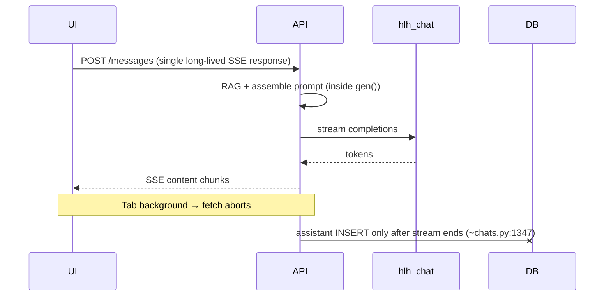
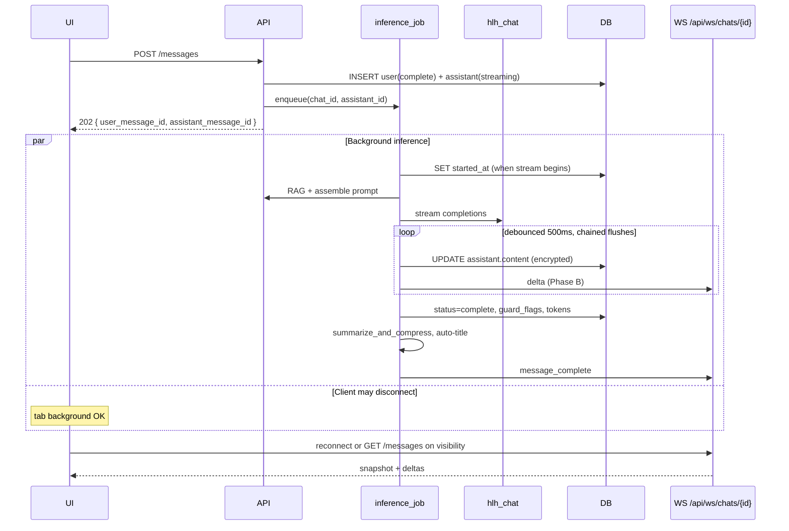

# Durable streaming inference — design

**Date:** 2026-05-26  
**Status:** Planned  
**Motivation:** Mobile Safari/Chrome backgrounding kills the in-flight SSE
`fetch` on `POST /api/chats/{id}/messages`. Inference is tied to that HTTP
connection, so switching apps often yields “Connection lost while waiting for
the model” with no saved assistant row.  
**Reference implementation:** BooCode (`/opt/boocode`) — recon verified 2026-05-26.  
**Estimated effort:** 4–6 days (phased; Phase A shippable in ~2 days)

---

## Goal

Allow chat inference to **survive client disconnect** (tab background, network
blip, lock screen) so that:

1. The model keeps running on the server after the user sends a message.
2. Partial assistant text is **persisted incrementally** (not only at stream end).
3. When the user returns to the tab, the UI **catches up** from Postgres (and
   optionally live deltas over WebSocket) without requiring a blind Retry.
4. Mobile users can switch apps during long CPU prefill (1–2 minutes on
   `cpu-std`) and still receive the answer.

**Friend-deployment requirement:** yes — primary pain is mobile Safari on the
operator’s Tailscale URL.

---

## Non-goals (this phase)

- Push notifications when a reply completes in background.
- Multi-user chat presence or cross-device sync beyond “reload messages.”
- Replacing `hlh_chat` or moving inference off the existing sidecar.
- Full BooCode broker/redis — single-process pub/sub inside `hlh_api` is enough.
- Modifying `frontend/src/hooks/useStream.js` (project hard rule). New hook
  beside it; migrate `ChatView` call sites only.
- BooCode tool-call frames, `message_parts`, doom-loop/cap-hit sentinels, coder
  ACP, per-user sidebar WS channel.

---

## Current vs target

### Today (SSE-coupled)



**Files:** `backend/routers/chats.py` (`gen()` + `_stream_inference`),
`frontend/src/hooks/useStream.js`, `frontend/src/components/chat/ChatView.jsx`.

### Target (BooCode-style, adapted)



### BooCode reference map

| Step | BooCode path |
|------|----------------|
| Send → 202 | `apps/server/src/routes/messages.ts` (POST `/api/chats/:id/messages`) |
| Detached runner | `services/inference/turn.ts` (`createInferenceRunner`, `enqueue`/`cancel`) |
| Stream + flush | `services/inference/stream-phase.ts` (`executeStreamPhase`, 500ms) |
| Complete / error | `services/inference/error-handler.ts` |
| WS + snapshot | `routes/ws.ts` + `services/broker.ts` |
| Client reconnect | `apps/web/src/hooks/useSessionStream.ts`, `wsReconnectToast.ts` |
| Stale UI | `components/panes/ChatPane.tsx` (60s content-length stall) |
| Discard stale | `routes/chats.ts` (`POST discard_stale`, min age 60s) |
| Force send | `routes/messages.ts` (`POST force_send` — cancel then new turn) |
| Sweeper | `index.ts` (boot + 60s interval, 5 min threshold) |

---

## BooCode patterns to adopt (and skip)

| BooCode | homelabhealth adaptation |
|---------|---------------------------|
| `POST /messages` → **202** | Same — break synchronous SSE response |
| Assistant `status='streaming'` at send | New column on `messages` |
| `publishUserMessage` (WS: started + delta + complete for **user** row) | **Phase B** — instant UI without waiting for poll |
| Debounced **chained** DB flush (500ms) | `services/inference_job.py` — see below |
| `cancel()` awaits `completed` promise | `ChatJobRegistry` — avoid stop→retry race |
| WebSocket + `snapshot` on connect | **Phase B:** `/api/ws/chats/{chat_id}` |
| In-process broker (no Redis) | `ChatEventBroker` in `hlh_api` |
| `discard_stale` + `force_send` | New endpoints; HLH `retry_last` for retry-without-dupe-user |
| Sweeper: streaming > 5 min → `failed` | `main.py` lifespan |
| Silent WS reconnect toasts | Port `wsReconnectToast.ts` thresholds |

**Skip:** tool-call/`tool_result` frames, `message_parts` table, doom-loop
sentinels, coder ACP, `/api/ws/user` sidebar channel, BooCode compaction
*design* (HLH keeps its own `summarize_and_compress` **call** at job end).

---

## Schema

Idempotent additions to `backend/schema.sql`:

```sql
-- Durable streaming: message lifecycle (BooCode-style subset).
ALTER TABLE messages ADD COLUMN IF NOT EXISTS status TEXT NOT NULL DEFAULT 'complete';
ALTER TABLE messages ADD CONSTRAINT messages_status_check
  CHECK (status IN ('streaming', 'complete', 'failed', 'cancelled'));

ALTER TABLE messages ADD COLUMN IF NOT EXISTS started_at TIMESTAMPTZ;
ALTER TABLE messages ADD COLUMN IF NOT EXISTS finished_at TIMESTAMPTZ;
ALTER TABLE messages ADD COLUMN IF NOT EXISTS error_message TEXT;

CREATE INDEX IF NOT EXISTS messages_chat_status_idx
  ON messages (chat_id, status)
  WHERE status = 'streaming';

-- Assistant rows start with empty content while streaming. Today content is
-- NOT NULL (schema.sql ~101); allow NULL OR empty string. Prefer:
ALTER TABLE messages ALTER COLUMN content DROP NOT NULL;
-- User messages still always have content (enforced in application layer).
-- encrypt_column('', assist_id) produces valid ciphertext for empty assistant.
```

**Semantics**

| `status` | Meaning |
|----------|---------|
| `complete` | Default for historical rows and finished turns |
| `streaming` | Assistant row created; inference in flight |
| `failed` | Inference error, timeout, sweeper, or discard-stale |
| `cancelled` | User Stop or superseded by force-send |

**Invariants**

- At most **one** `streaming` assistant row per chat:
  ```sql
  SELECT id FROM messages
  WHERE chat_id = $1 AND role = 'assistant' AND status = 'streaming'
  ```
  Return **409** if found — unless client used discard-stale or force-send first.
- User messages always `complete`.
- **`started_at`** set when inference **starts streaming** (inside job), not at
  INSERT — enqueue may lag behind 202 response (BooCode `stream-phase.ts`).
- Exclude `status='streaming'` rows from inference context assembly (like BooCode
  `payload.py` skipping streaming assistants).

**API:** extend message JSON with `status`, `started_at`, `finished_at`;
omit `error_message` when null.

**Persisted vs ephemeral**

- **`status`** on the row is the source of truth for reconnect/poll.
- **Phase strings** (`preparing`, `rag`, `inference`) stay **ephemeral** — WS
  frames or optional `phase` field in poll response only; no DB column.

---

## Backend design

### Stream wrapper — do not refactor `_stream_inference`

Keep `backend/routers/chats.py::_stream_inference()` unchanged for the legacy
SSE path. The job **wraps** it:

```python
visible = ThinkingStreamFilter()
async for chunk in _stream_inference(provider, model, api_messages):
    piece = extract_sse_content(chunk)  # parse {"content": "..."}
    if not piece:
        continue
    for out in visible.feed(piece):
        state.accumulated += out
        schedule_content_flush(assistant_id, state.accumulated)
        broker.publish(chat_id, {"type": "delta", "message_id": assistant_id, "content": out})
for tail in visible.flush():
    ...
await flush_now()  # final chained flush before status flip
```

Apply `strip_thinking_text` / `ThinkingStreamFilter` before persist and publish.

### New module: `services/inference_job.py`

Extract from `chats.py` `gen()`:

1. Load chat, workspace, provider, messages (decrypt PHI).
2. Input guard runs in **send handler** before enqueue (unchanged).
3. `_assembled_system_prompt()` + optional SearXNG (inside job).
4. Stream wrapper loop (above).
5. **`UPDATE messages SET started_at = NOW()`** when stream phase begins.
6. On success: `scan_output`, encrypt final content, `status='complete'`,
   `finished_at`, tokens, `guard_flags`, `safeguard_version`.
7. On error: `status='failed'`, `error_message` via `redact_text()` / log
   redactor — no raw provider URLs with keys.
8. On cancel: `status='cancelled'`.
9. Post-complete (always): **`summarize_and_compress`**, auto-title, auto-memory.

### DB flush — debounce + sequential chain

BooCode chains flushes so concurrent timers cannot write stale `accumulated`
(`stream-phase.ts:357–367`). Port both parts:

```python
DB_FLUSH_INTERVAL_MS = 500

flush_chain: asyncio.Future = asyncio.sleep(0)  # no-op seed

def schedule_content_flush(assistant_id: UUID, plaintext: str) -> None:
    """Debounce; each flush waits for prior flush to finish."""
    ...

async def flush_now(assistant_id: UUID, plaintext: str) -> None:
    nonlocal flush_chain
    ciphertext = encrypt_column(plaintext, str(assistant_id))
    flush_chain = asyncio.ensure_future(
        _chain(flush_chain, _update_content(assistant_id, ciphertext))
    )
```

`finally` in job: clear debounce timer, **`await flush_chain`**, then flip
`status` to `complete`/`failed`/`cancelled`.

### Job registry: `services/chat_jobs.py`

Mirror BooCode `turn.ts:385–444` — not bare `asyncio.Task`:

```python
@dataclass
class InferenceRegistration:
    task: asyncio.Task
    cancel_event: asyncio.Event
    completed: asyncio.Future  # resolves in task finally

class ChatJobRegistry:
    registry: dict[UUID, InferenceRegistration]

    async def enqueue(chat_id: UUID, assistant_id: UUID) -> None: ...
    async def cancel(chat_id: UUID) -> bool:
        """Abort signal + await completed before return (stop→retry safe)."""
    def has_active(chat_id: UUID) -> bool: ...
```

- One registration per chat.
- `force_send` may replace registry entry; old task's `finally` must not delete
  a newer registration (BooCode: `if registry.get(chatId) === registration`).

### Event broker: `services/chat_events.py` (Phase B)

In-memory `dict[chat_id, set[asyncio.Queue]]`. Validate frames with Pydantic
(`services/chat_ws_frames.py`) — BooCode uses Zod fail-closed.

| `type` | Payload |
|--------|---------|
| `snapshot` | `{ messages: Message[] }` on WS connect |
| `message_started` | `{ message_id, role }` |
| `delta` | `{ message_id, content }` |
| `message_complete` | `{ message_id, prompt_tokens, completion_tokens, ... }` |
| `error` | `{ message_id?, error }` |
| `phase` | `{ phase }` — ephemeral; same strings as today’s SSE phases |

**Phase B send path:** after INSERT user row, publish user message like BooCode
`publishUserMessage` (`index.ts:155–172`) so connected clients update without poll.

### Router changes: `routers/chats.py`

**`POST /api/chats/{chat_id}/messages`** (when `durable_streaming_enabled`):

1. Existing validation (auth, workspace, guard input, user insert / `retry_last`).
2. 409 if another `streaming` assistant exists (unless internal force path).
3. Insert assistant: `content=''` or NULL, `status='streaming'`, `ai_generated=true`.
   Do **not** set `started_at` here.
4. `registry.enqueue(chat_id, assistant_id)`.
5. Return **202** `{ user_message_id, assistant_message_id, status: "streaming" }`.
6. No `StreamingResponse`.

When flag off: current SSE `gen()` path unchanged.

**New endpoints**

| Method | Path | Purpose |
|--------|------|---------|
| `POST` | `/api/chats/{id}/stop` | `cancel()` + assistant → `cancelled` |
| `POST` | `/api/chats/{id}/messages/{msg_id}/discard-stale` | `streaming` + age ≥ **60s** → `failed`; else 409 |
| `POST` | `/api/chats/{id}/force-send` | Await cancel (5s timeout), then new user+assistant + enqueue (BooCode `force_send`) |
| `GET` | `/api/ws/chats/{id}` | WebSocket — Phase B |

**Retry after stale (HLH):** `discard-stale` + `retry_last` on existing user row,
or single `force-send` if we need a fresh assistant row without duplicating user.

### Lifespan sweeper (`main.py`)

Every 60s (match BooCode boot + periodic):

```sql
UPDATE messages
SET status = 'failed',
    finished_at = NOW(),
    error_message = 'inference timed out'
WHERE status = 'streaming'
  AND COALESCE(started_at, created_at) < NOW() - INTERVAL '5 minutes';
```

Cancel orphaned registry entries for swept rows.

### Feature flag

```sql
INSERT INTO global_settings (key, value) VALUES ('durable_streaming_enabled', 'false')
ON CONFLICT (key) DO NOTHING;
```

Default **off** until verify passes. Optional Settings → System toggle.

### Encryption & reasoning

- Every flush: `encrypt_column(accumulated, str(assistant_id))`.
- `services/reasoning_strip.py` on persist and publish — visible text only.

---

## Frontend design

**Hard rule:** do not edit `useStream.js`.

### Phase A — poll on visibility (no WebSocket)

New hook: `frontend/src/hooks/useDurableChat.js`

- `sendMessage()` → POST → expect **202** + ids.
- Poll `GET /messages` while any `status === 'streaming'`:
  - **1s** for first 10s (CPU prefill UX on mobile), then **2s**, back off to **5s** after 30s.
- `document.visibilitychange` → immediate refetch when `visible`.
- Merge DB `content` into assistant bubble (no local `streamText` accumulator).

**Stale detection** (reuse / align with `ChatView` + BooCode `ChatPane`):

- Track `{ message_id, content.length, last_change_at }` for the streaming assistant.
- If length unchanged for **60s** → `StaleStreamBanner` (Retry / Discard).
- Watcher runs on every poll **and** WS delta (Phase B) — not time-since-send alone.

`ChatView.jsx`: branch on flag; durable vs legacy `useStream`.
Retry → `retry_last`; Discard → discard-stale API.

### Phase B — WebSocket

`frontend/src/hooks/useChatEvents.js`:

- Connect `wss://…/api/ws/chats/{chatId}`.
- On open: apply `snapshot`; merge `delta` / `message_complete` like
  `useSessionStream.ts`.
- Reconnect: exponential backoff 1s → 30s cap; silent early failures
  (`wsReconnectToast.ts`: 3 fails / 15s → gray toast; 60s → red + Retry).

Prefer WS when connected; poll fallback when WS down.

### UI states

| DB `status` | Bubble |
|-------------|--------|
| `streaming` | Live content from DB/WS + status bar |
| `complete` | Normal message |
| `failed` | Inline error + Retry |
| `cancelled` | Hidden or “Stopped” stub |

Hide duplicate pending bubble when status bar active (existing fix).

---

## Migration and compatibility

1. Schema + backend, flag **off** — zero behavior change.
2. Dev: flag on + `verify_durable_streaming.py`.
3. Phase A poll UI behind flag.
4. Tag (e.g. `v0.27.0`); document mobile upgrade note.
5. Phase B WS in following release.
6. Deprecate SSE send path after one release with flag on; remove ~`v0.29.0`.

Historical messages: all `status='complete'`.

---

## Verification

`backend/scripts/verify_durable_streaming.py`:

1. Session auth; POST with flag on → **202** + assistant id.
2. Poll until `status='complete'` or 120s timeout; content non-empty; no `thought` leak.
3. **Disconnect test:** abort client early; poll shows content still growing.
4. **Cancel test:** stop → await → `cancelled`; retry does not 409 on ghost streaming row.
5. Sweeper: synthetic `streaming` row aged 6 min → `failed`.
6. Phase B: WS reconnect receives `snapshot` with partial content.

`verify_durable_streaming.sh` wrapper; doctor WARN if flag on but no sweeper.

---

## Security and audit

- WS auth: `hlh_session` on upgrade; 4401 if missing.
- Max ~3 WS connections per chat (tab multiplication).
- `error_message` redacted before INSERT.
- Audit `inference.*` actions — defer unless needed.

---

## Performance notes (cpu-std)

- ~2 chained UPDATEs/s per active chat during stream — OK for single-user.
- Poll beats background SSE (no hung connection).
- Profile `encrypt_column` per flush on GPU tiers if needed.

---

## Implementation plan

### Phase A (~2 days)

| Step | Task |
|------|------|
| A1 | Schema (`status`, timestamps, `content` nullable) + API fields |
| A2 | `InferenceRegistration` + `ChatJobRegistry` |
| A3 | `inference_job.py` — wrap `_stream_inference`, chained flush, `started_at` |
| A4 | Send 202 path + stop + discard-stale (+ optional force-send) |
| A5 | Lifespan sweeper |
| A6 | `useDurableChat.js` + `ChatView` branch + stale length watcher |
| A7 | `verify_durable_streaming.py` |

### Phase B (~2 days)

| Step | Task |
|------|------|
| B1 | `ChatEventBroker` + Pydantic frame models |
| B2 | WS route + snapshot; `publishUserMessage` on send |
| B3 | Delta/complete publish from job |
| B4 | `useChatEvents.js` + reconnect toasts |
| B5 | Verify WS reconnect |

### Phase C (~1 day)

| Step | Task |
|------|------|
| C1 | Default flag on; CHANGELOG + `architecture.md` |
| C2 | Remove SSE send path |
| C3 | Roadmap entry |

---

## Resolved design decisions

| Question | Decision |
|----------|----------|
| RAG timing | Inside job after 202; phase events ephemeral (WS/poll only) |
| Auto-title while away | Job completes → existing auto-title path |
| Concurrent streaming | One job per **chat**, not global |
| Compaction | Call existing `summarize_and_compress` at job end — do not port BooCode compaction |
| Legacy SSE | Keep until Phase C; do not refactor `_stream_inference` |

---

## Docs to update on ship

- `docs/architecture.md` — durable flow diagram.
- `CHANGELOG.md`, `docs/roadmap.md`, `AGENTS.md`.

---

## Success criteria

- Mobile Safari: send, background 90s, return — assistant complete or still
  growing in DB.
- Flag off: no regression (existing verify + UI).
- Stop → retry never leaves orphan `streaming` row.
- Doctor + verify green after `docker compose build --no-cache hlh_api`.
